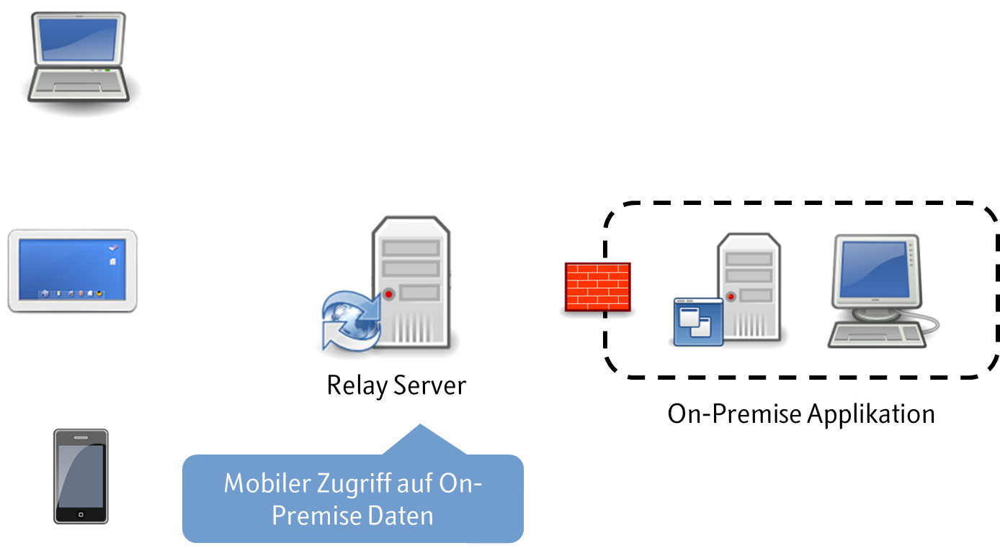
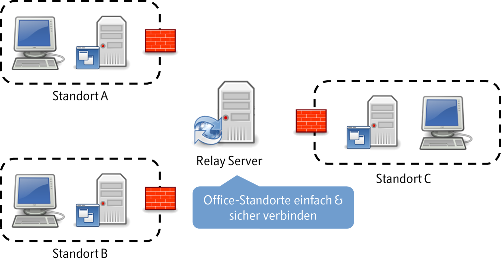

# [Was ist der Thinktecture RelayServer?](1-was-ist-der-thinktecture-relayserver.md)

Der Thinktecture RelayServer (nachfolgend kurz RelayServer genannt) ermöglicht als Open Source Software eine bi-direktionale, sichere Kommunikation von Clients, mobilen Endgeräten und Applikationen mit On-Premises Applikationen hinter Routern und Firewalls über das HTTPS-Protokoll bei vollständiger zentraler Kontrolle und Auditierung der zulässigen Teilnehmer und der erlaubten Daten.

Ein für Client-Anwendungen und On-Premises Applikationen gleichermaßen erreichbarer Server bildet einen sicheren Austauschpunkt für Nachrichten und Daten. Da der Server unter der vollen Kontrolle des Betreibers steht und sowohl mit Clients als auch On-Premises Applikationen durchgängig verschlüsselt kommuniziert, ist die Sicherheit der übertragenen Daten jederzeit gewährleistet.

Die Positionierung des RelayServers im öffentlichen Internet sorgt weiterhin dafür, dass sowohl Clients als auch On-Premises Applikationen nur ausgehende Verbindungen zur Kommunikation aufbauen müssen. Damit sind Firewalls, Router und NAT-Systeme in der Regel ebensowenig ein Problem, wie häufig wechselnde IP-Adressen von einfachen DSL-Anschlüssen oder Mobilfunkverbindungen.

# Vorteile des RelayServers

- Open Source Software
- Vollständige Datenhoheit liegt beim Betreiber des RelayServers
- Als reine Softwarelösung schnell implementierbar
- Für die Client-Software sind keine Libraries notwendig
- Die Lösung ist mandantenfähig, so dass über einen RelayServer Daten für mehrere verschiedene On-Premises Applikationen und deren Clients fließen können
- Firewalls, NAT und Proxies stellen in der Regel kein Problem dar
- Der Transportkanal ist via HTTPS-Verbindung verschlüsselt
- Die On-Premises Applikation benötigt als Minimalanforderung eine offene ausgehende HTTPS-Verbindung
- Keine spezielle Hardware notwendig
- Keine Firewall-Änderungen notwendig
- Keine Datenhaltung in einer DMZ notwendig

# Zielsetzung des RelayServers

Die Anforderungen an Unternehmens-Applikationen haben sich in den letzten Jahren massiv verändert. Die bisherigen Applikations-Umgebungen bestehend aus Servern und Desktop-basierten Clients in einem lokalen, abgesicherten Netzwerk adressieren nicht mehr die aktuelle Realität.

Unternehmen und Anwender verlangen von ihren Lösungsanbietern konkrete Antworten zu diesen wesentlichen Herausforderungen:

## Herausforderung: Sicherer mobiler Datenzugriff

 
Mobile Endgeräte wie Laptops, Tablets und Smartphones sind aus dem beruflichen Alltag nicht mehr wegzudenken. Beim Zugriff auf Unternehmensdaten über solche Geräte entsteht schnell der Wunsch, nicht mehr an das lokale Netzwerk gebunden zu sein. Die bisherigen Grenzen des Netzwerks müssen daher "durchlässig" werden, ohne dabei die Sicherheit der Unternehmensdaten zu gefährden.

Der RelayServer unterstützt dafür die sichere Verbindung von mobilen Endgeräten mit On-Premises Applikationen rein auf Basis von Software. Der On-Premises Server kann dabei über einen einfachen dynamischen DSL-Uplink oder eine 3G-Verbindung mit dem Internet verbunden sein.

## Herausforderung: Standortvernetzung

Unternehmen existieren heute meist nicht nur an einem Ort sondern erstrecken sich über viele Standorte in Form von Außenstellen oder Filialen. Aus dieser örtlichen Verteilung ergibt sich die Notwendigkeit einer effektiven Datenvernetzung, damit alle Standorte untereinander mit den gleichen Unternehmensdaten arbeiten können.

Der RelayServer sorgt für eine schnelle und unkomplizierte Vernetzung der Standorte und integriert sich dabei nahtlos in die zu vernetzende Applikation. Auch hier kann der On-Premises Server über einen einfachen dynamischen DSL-Uplink oder eine 3G-Verbindung mit dem Internet verbunden sein.

# Konkurrierende Lösungsmöglichkeiten des RelayServers

## Offene Firewall-Ports

Zum Zugriff auf On-Premises Applikationen kann in der Unternehmens-Firewall ein entsprechender Port geöffnet werden. Zugreifende Clients sollten sich dann über entsprechende Zertifikate bei der On-Premises Applikation oder der Firewall authorisieren, um eine sichere Kommunikation zu ermöglichen

Nachteile:

1. Firewall muss über eine statische I, einen offiziellen DNS- oder einen DynDNS-Eintrag erreichbar sein.
1. On-Premises Applikation oder die Firewall muss die Authorisierung von zugreifenden Clients mit Zertifikaten unterstützen.
1. Zertifikate müssen regelmäßig erneuert und dann auf den zugreifenden Devices der Clients verteilt werden, was einen hohen logistischen Aufwand bedeutet.
1. Zertifikats-Management auf Devices erhöht die Support-Aufwände und erschwert den Anwendern die Konzentration auf ihre eigentliche Arbeit.
1. Die notwendigen Firewall-Konfigurationen sind nur durch fachlich geschultes Personal durchführbar.

## VPN

Virtual Private Networks (VPNs) erlauben durch die Bildung abgesicherter virtueller Netzwerke grundsätzlich eine sichere Kommunikation zwischen mobilen Clients und On-Premises Applikation.

Nachteile:

1. Vor jedem On-Premises Server ist ein VPN-Gateway notwendig, mit dem sich die VPN-Clients verbinden können. Diese Gateways bedeutet häufig größere Investitionen, die das IT-Budget des Unternehmens belasten.
1. Für die Einrichtung und die Administration von VPN-Gateways ist fachlich geschultes Personal notwendig.
1. VPNs werden häufig mit der Freigabe von entsprechenden Ports - wie unter "Offene Firewall-Ports" dargestellt - kombiniert. Dies erzeugt ein außerordentlich komplexes und kostenintensives Setup
1. Die Devices der Clients müssen den Aufbau von VPN-Verbindungen unterstützten; dazu muss häufig eine spezielle VPN-Software installiert, konfiguriert und aktuell gehalten werden.
1. Die Akzeptanz von VPNs bei Anwendern ist nicht besonders ausgeprägt, da der erfolgreiche Aufbau von VPN-Verbindungen oft als problematisch und kompliziert erlebt wird.

## Cloud Services

Über Services in der Cloud können Clients und On-Premises Applikationen einfach durch die Nutzung entsprechender Software Libraries verbunden werden. Doch auch hier gibt es einige Nachteile:

Je nach Sitz des Cloud-Anbieters und Zielbranche der Anwendung kann die Verwendung der Cloud als Relay-Punkt dem Bundesdatenschutzgesetz (BDSG) widersprechen. Auch eine Verschlüsselung des Nachrichtentransports mit SSL hilft nicht weiter, da in der Cloud die zuvor schützende SSL-Verschlüsselung für die Verarbeitung der Nachrichten aufgehoben werden muss und die Nachrichten in diesem Moment unverschlüsselt vorliegen.

Cloud Services bieten außerdem oft nur einen Minimal-Set an Features und berücksichtigen nicht die unterschiedlichen Anforderungen von Unternehmen. Individuelle Anpassungen sind in der Regel nicht vorgesehen.
