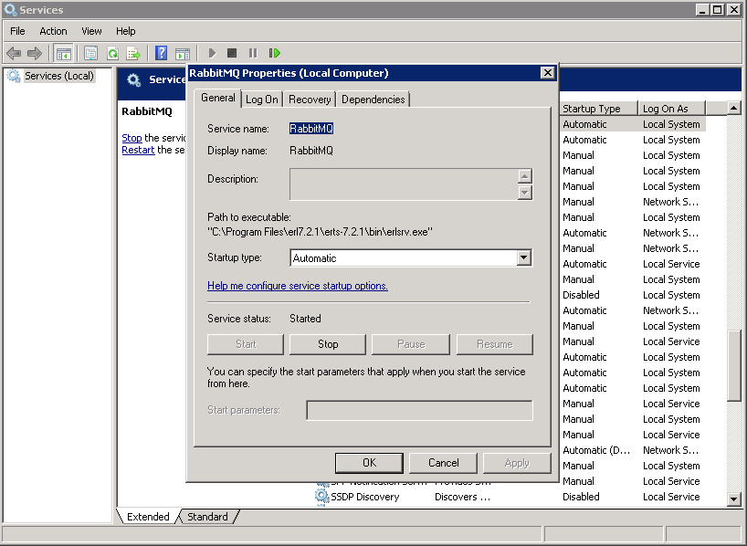
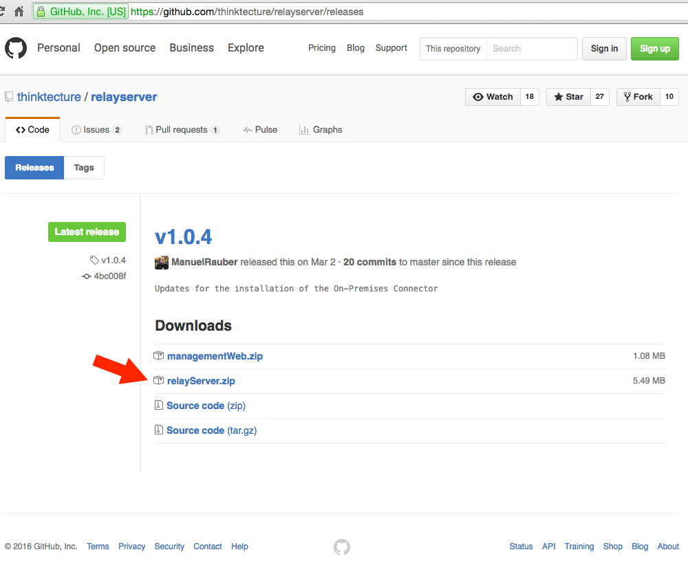

# Installation des RelayServers

## Voraussetzungen

Zum Betrieb des RelayServers müssen auf dem dafür verwendeten Windows Server folgende Software-Bestandteile installiert sein:

* Microsoft .Net-Framework v4.6 oder höher
* Microsoft SQL Server (Express) 2014 oder neuer
* RabbitMQ mit Erlang-Ausführungsumgebung

### RabbitMQ mit Erlang-Ausführungsumgebung

Die Installation von RabbitMQ, welches eine installierte Erlang-Ausführungsumgebung voraussetzt, ist unter [http://www.rabbitmq.com/install-windows.html](http://www.rabbitmq.com/install-windows.html) ausführlich beschrieben. Es sollten dabei keine abweichenden Ports gewählt werden, um Unstimmigkeiten im weiteren Verlauf der Installation des RelayServers zu vermeiden.

Nach der Installation von Erlang und RabbitMQ ist es sinnvoll, die Management Weboberfläche für RabbitMQ zu aktivieren. Die Aktivierung erfolgt im RabbitMQ Command Prompt, der durch die Installation von RabbitMQ in der gleichnamigen Programmgruppe im Startmenü angelegt worden ist. Diesen bitte mit Administrator-Rechten starten. Im RabbitMQ Command Prompt müssen die nachfolgenden Befehle ausgeführt werden:

```
rabbitmq-plugins enable rabbitmq_management
rabbitmq-service stop
rabbitmq-service start
```


Jetzt lässt sich das Management Web von RabbitMQ unter [http://127.0.0.1:15672/](http://127.0.0.1:15672/) aufrufen und meldet sich mit dem Login.


**Hinweis** : Sollte die Management Weboberfläche von RabbitMQ nicht aufrufbar sein, so ist sehr wahrscheinlich während der Installation von RabbitMQ der zugehörige Service nicht fehlerfrei installiert worden. Dazu muss in der Windows Service Konsole geprüft werden, ob der RabbitMQ Service eine Beschreibung enthält. Fehlt die Service-Beschreibung wie im nachfolgenden Screenshot, dann konnte der RabbitMQ Installer den Service nicht korrekt installieren.



In diesem Fall muss der Service von Hand einmal deinstalliert und wieder neu installiert werden. Dazu wird der RabbitMQ Command Prompt als Administrator gestartet und die nachfolgenden Befehle ausgeführt:

```
rabbitmq-service remove
rabbitmq-service install
net start rabbitmq
```


Nach dieser Korrektur sollte der Service mit Beschreibung in der Windows Service Konsole vorhanden sein und das Management Web verfügbar sein.

Mit den Default-Anmeldedaten guest / guest erfolgt der Login und die Statusübersicht von RabbitMQ erscheint.


## Installation

Der einfachste Weg der Installation des RelayServers ist die Verwendung des fertigen ZIP-Pakets von GitHub unter

```
https://github.com/thinktecture/relayserver/releases
```



Das Zip kann in dem für den RelayServer vorgesehen Ordner entpackt werden. Dem Ordner müssen nun über den Windows Explorer / Eigenschaften Full Control Rechte für den Network Service zugewiesen werden. Dies ist notwendig, damit RelayServer in diesem Ordner später als Windows Service gestartet werden kann.

In einem Kommandozeilenfenster mit Administrator-Rechten wird nun in den angelegten Ordner gewechselt und der RelayServer als Windows Service installiert:

```
Thinktecture.Relay.Server.exe install
```

Wenn gewünscht, kann per Paramter sowohl der Windows Service Name als auch der Windows Service Anzeigename individuell angepasst werden:

```
-servicename=ServiceName
-displayname=DisplayName
```

Als Standardname verwendet die Installationsroutine den Namen „TTRelayServer". Durch die Installation ist der RelayServer Dienst so konfiguriert, dass er beim Start von Windows automatisch gestartet wird.

Vor dem ersten Start des gerade installierten RelayServers sollte passend konfiguriert werden. Dazu bitte die nächsten Abschnitte beachten.

Der RelayServer kann entweder aus der Serviceverwaltungskonsole von Windows oder über die noch geöffnete Kommandozeile gestartet werden:

```
Thinktecture.Relay.Server.exe start -servicename=ServiceName
```

Die Angabe des Parameters „-servicename" ist notwendig, wenn es mehrere RelayServer auf dem System geben sollte.

## Deinstallation

Um den RelayServer Dienst zu entfernen, wechselt man in einem Kommandozeilenfenster mit Administrator-Rechten in den Ordner des RelayServer und ruft diesen Befehl auf:

```
Thinktecture.Relay.Server.exe uninstall
```

# Konfiguration des RelayServers

Der RelayServer wird über die Thinktecture.Relay.Server.exe.config im Ordner des RelayServers konfiguriert. Zum Editieren dieser Datei kann jeder beliebige Texteditor (z.B. Notepad) verwendet werden. Als Ausgangsbasis empfiehlt sich die Verwendung der Beispielkonfiguration

```
SAMPLE_Thinktecture.Relay.Server.exe.config
```


Diese Konfigurationsdatei sollte nach der initialen Bearbeitung als

```
Thinktecture.Relay.Server.exe.config
```

abgespeichert werden.

## Connection Strings

Die Verbindungen des RelayServer zu den beteiligten Tools RabbitMQ und Microsoft SQL Server werden im Abschnitt <connectionStrings></connectionStrings> der Konfigurationsdatei konfiguriert. Standardmäßig finden sich in diesem Abschnitt daher diese beiden Verbindungseinstellungen:

```
<add name="RabbitMQ" connectionString="host=localhost" />
<add name="RelayContext" connectionString="Server=.\SQLEXPRESS;Trusted\_Connection=True;Database=RelayServer" providerName="System.Data.SqlClient" />
```

Wenn während der Installation von RabbitMQ und Microsoft SQL Server keine abweichenden Einstellungen vorgenommen wurden, dann sind diese Verbindungseinstellungen ausreichend. Ansonsten müssen die Einstellungen entsprechend zu den Abweichenden Einstellungen von RabbitMQ oder Microsoft SQL Server angepasst werden (andere Ports oder separater Server für RabbitMQ oder Microsoft SQL Server).

## Settings

Die Konfiguration des RelayServers erfolgt im Abschnitt

```
<appSettings></appSettings>
```

Die Standardeinstellungen umfassen dabei:

```
<appSettings>
    <add key="RabbitMqClusterHosts" value="" />
    <add key="QueueExpiration" value="00:00:10" />
    <add key="RequestExpiration" value="00:00:10" />
    <add key="OnPremiseConnectorCallbackTimeout" value="00:00:30" />
    <add key="TraceFileDirectory" value="tracefiles" />
    <add key="LinkPasswordLength" value="100" />
    <add key="DisconnectTimeout" value="6" />
    <add key="ConnectionTimeout" value="5" />
    <add key="KeepAliveInterval" value="2" />
    <add key="UseInsecureHttp" value="false" />
    <add key="EnableManagementWeb" value="true" />
    <add key="EnableRelaying" value="true" />
    <add key="EnableOnPremiseConnections" value="true" />
    <add key="HostName" value="+" />
    <add key="Port" value="443" />
    <add key="ManagementWebLocation" value="ManagementWeb" />
    <add key="TemporaryRequestStoragePath" value="" />
    <add key="TemporaryRequestStoragePeriod" value="00:01:00" />
    <add key="ActiveConnectionTimeout" value="00:02:00" />
    <add key="CustomCodeAssemblyPath" value="" />
    <add key="SharedSecret" value="" />
    <add key="OAuthCertificate" value="" />
    <add key="HstsHeaderMaxAge" value="365.00:00:00" />
    <add key="HstsIncludeSubdomains" value="false" />
    <add key="IncludeErrorDetailPolicy" value="Default" />
    <add key="MaxFailedLoginAttempts" value="5" />
    <add key="FailedLoginLockoutPeriod" value="00:15:00" />
    <add key="SecureClientController" value="false" />
    <add key="AccessTokenLifetime" value="365.00:00:00" />
</appSettings>
```

|  Key name | Description |
| --- | --- |
| RabbitMqClusterHosts | Komma-separierte Liste der RabbitMQ Cluster Teilnehmer (default _null_) |
| QueueExpiration | Zeit, nach der eine ungenutzte Queue komplett verworfen wird (default 10 Sekunden) |
| RequestExpiration | Zeit, nach der ein noch nicht abgearbeiteter Request aus der Queue verworfen wird (default 10 Sekunden) |
| OnPremiseConnectorCallbackTimeout| Zeitspanne, die der RelayServer auf eine Antwort des On-Premise Connectors wartet (default 30 Sekunden) |
| TraceFileDirectory | Pfad zum Verzeichnis, in das Trace-dateien geschrieben werden, wenn traceing aktiviert ist (default 'tracefiles') |
| LinkPasswordLength | Länge der Passwörter, die für neue links automatisch generiert werden (default 100) |
| DisconnectTimeout | Zeitspanne, nach der für nicht mehr über SignalR verbundene On-Premise Connectoren das OnDisconnect event ausgelöst wird (default 6 Sekunden) |
| ConnectionTimeout | Zeitspanne, nach der eine nicht mehr aktive SignalR Verbindung zu einem On-Premise Connector geschlossen wird (default 5 Sekunden) |
| KeepAliveInterval | Zeitspanne, nach der Keepalive Pakete über die SignalR Verbindung an verbundene On-Premise Connectoren gesendet werden (default und Minimum DisconnectTimeout / 3 Sekunden) |
| UseInsecureHttp | Aktiviert die Verwendung von HTTP statt HTTPS (die Verwendung von HTTP im Produktivbetrieb wird nicht empfohlen) (default false) |
| EnableManagementWeb | Aktiviert die Management Weboberfläche (default true) <br/> Mögliche Werte: true (an), false (aus), local (es werden nur Anfragen von localhost beantwortet) |
| EnableRelaying | Aktiviert die Relay-Funktion des Servers (default true) <br/> Mögliche Werte: true (an), false (aus), local (es werden nur Anfragen von localhost beantwortet) |
| EnableOnPremiseConnections | Erlaubt den Verbindungsaufbau von On-Premises Connectoren (default true) <br/> Mögliche Werte: true (an), false (aus), local (es werden nur Anfragen von localhost beantwortet) |
| HostName | Gewünschte Ziel-URL des RelayServers (default +) |
| Port | Standard-Port des RelayServers (default 443) |
| ManagementWebLocation | Pfad zu den Dateien des Management-Webs (default 'ManagementWeb') |
| TemporaryRequestStoragePath | Pfad zu einem Verzeichnis in dem die Daten der Requests temporär abgelegt werden (default _null_) <br/> Im Multi-Server-Betrieb muss dieses Verzeichnis von allen Nodes gelesen und beschrieben werden können. Wenn kein Wert angegeben ist werden die Requests im Speicher gehalten, es ist dann kein Multi-Server-Betrieb möglich. |
| TemporaryRequestStoragePeriod | Gibt die Zeitspanne an, nach der nicht mehr verwendete temporäre Dateien gelöscht werden (default und Minimum doppelter OnPremiseConnectorCallbackTimeout) |
| ActiveConnectionTimeout | Zeit, nach der eine Verbindung zwischen einem On-Premise Connector und dem RelayServer als nicht mehr aktiv angesehen wird (default 120 Sekunden) |
| CustomCodeAssemblyPath | Pfad zu einem Assembly, in dem zusätzlicher Code implementiert ist (default _null_) <br/> Entweder absolut oder relativ zum RelayServer |
| SharedSecret | Base64 encodiertes Shared Secret (default _null_) <br/> Wenn gesetzt, werden die JWT Tokens für die Authorisierung von On-Premise Connectoren und ManagementWeb User hiermit signiert. Wird benötigt für einen unterbrechungsfreien Failover der SignalR Verbindung bei der Verwendung eines Load-Balancers. |
| OAuthCertificate | Base64 encodiertes X509 Zertifikat (default _null_) <br/> Wenn gesetzt, werden die JWT Tokens für die Authorisierung von On-Premise Connectoren und ManagementWeb User hiermit signiert |
| HstsHeaderMaxAge | Wert, der im HTTP Strict Transport Security Header für `max-age` gesetzt werden soll (default 365 Tage) |
| HstsIncludeSubdomains | Gibt an, ob im HTTP Strict Transport Security Header der optionale Parameter `includeSubDomains` gesetzt werden soll (default false) |
| IncludeErrorDetailPolicy | Legt fest, ob Fehlerdetails (Stacktrace, Exception Messages) ausgegeben werden (default 'default') <br/> Zur Erläuterung der möglichen Werte siehe [MSDN](https://msdn.microsoft.com/de-de/library/system.web.http.includeerrordetailpolicy(v=vs.118).aspx) |
| MaxFailedLoginAttempts | Anzahl von erfolglosen Login-Versuchen für einen User, bevor dieser temporär gesperrt wird (default 5) |
| FailedLoginLockoutPeriod | Zeit, die ein User nach dem letzten erfolglosen Login-Versuch über `MaxFailedLoginAttempts` gesperrt wird (default 15 Minuten) |
| SecureClientController | Legt fest, ob ein Client für jeden Request an den `/relay` Endpunkt einen gültigen AccessToken eines On-Premise Connectors / Links mitsenden muss (default false) |
| AccessTokenLifetime | Zeitspanne für die ein ausgestelltes AccesssToken für On-Premise Connectoren sowie Management Web Benutzer gültig ist (default 365 Tage) <br/> _Hinweis:_ Ein zu kleiner Wert schränkt die Benutzbarkeit des Management Webs ein |

## netsh settings

### Konfiguration der URL ACL

Um den RelayServer mit einer HTTPS-Verbindung zu betreiben, muss eine URL ACL in der loaklen Windowskonfiguration eingerichtet werden. Dazu muss von einer Kommandozeile mit Administrator-Rechten dieser Befehl ausgeführt werden:

```
netsh http add urlacl https://+:443/ user="NETWORK SERVICE"
```

Es kann notwendig sein, den Port auf einen anderen Wert als 443 zu setzen, wenn zuvor die Standardwerte bereits verändert wurden oder der Port auf dem Windows Server bereits benutzt wird.

Sollte statt einer HTTPS-Verbindung eine normale und damit ungesicherte http-Verbindung gewünscht sein, dann muss in der Konfiguration des RelayServers das Attribut AllowInsecureHttp aktiviert werden.

### Konfiguration von SSL

Die Konfiguration von SSL ist notwendig, wenn der RelayServer seinen Datenverkehr über sichere HTTPS-Verbindungen abwickeln soll. Die Verwendung von HTTPS ist der Standardwert und wird ausdrücklich empfohlen.

Um ein SSL-Zertifikat zu installieren, muss die Microsoft Management Console gestartet werden:

```
run -> mmc
```

1. Klicken Sie im Menü Datei auf Snap-In hinzufügen/entfernen.
1. Klicken Sie im Dialogfeld Snap-In hinzufügen/entfernen auf Hinzufügen.
1. Klicken Sie im Dialogfeld Eigenständiges Snap-In hinzufügen auf Zertifikateund klicken Sie dann auf Hinzufügen.
1. Klicken Sie im Dialogfeld Zertifikat-Snap-in klicken Sie auf Computerkonto, und klicken Sie auf Weiter.
1. Klicken Sie im Dialogfeld Computer auswählen auf Lokaler Computer: (der Computer, auf diese Konsole ausgeführt wird), und klicken Sie dann auf Fertig stellen.
1. Klicken Sie im Dialogfeld Eigenständiges Snap-In hinzufügen auf Schließen.
1. Klicken Sie im Dialogfeld Snap-In hinzufügen/entfernen auf OK.
1. Doppelklicken Sie im linken Bereich der Konsole auf Zertifikate (lokaler Computer).
1. PersönlicheMaustaste, zeigen Sie auf Alle Tasksund klicken Sie auf Importieren.
1. Klicken Sie auf der Seite Willkommen des Assistenten auf Weiter.
1. Klicken Sie auf Durchsuchenauf der Seite Importdateiname suchen Sie Zertifikatdatei, und klicken Sie auf Weiter.
1. Wenn das Zertifikat über ein Kennwort verfügt, geben Sie das Kennwort auf der Seite und klicken Sie auf Weiter.
1. Auf der Seite Zertifikatspeicher auf Alle Zertifikate in folgendem Speicher speichernund klicken Sie dann auf Weiter.
1. Klicken Sie auf Fertig stellen, und dann auf OK, um zu bestätigen, dass der Import erfolgreich war.

Über ein Kommandozeilenfenster mit Administrationsrechten muss folgender Befehl ausgeführt werden:

netsh http add sslcert ipport=0.0.0.0:443 certhash=thumbprint appid={guid}

Es muss sichergestellt sein, dass der Port dabei dem Port aus der Konfigurationsdatei des RelayServers entspricht. Der Thumbprint muss mit dem Thumbprint aus der SSL-Konfiguration ersetzt werden. Der Parameter GUID muss mit einer zufälligen GUID ersetzt werden (z.B. von https://www.guidgenerator.com/).

## Konfiguration der Firewall

Wenn der RelayServer für Clients und On-Premises Applikationen ohne Einschränkungen erreichbar sein soll, dann muss die Windows Firewall für die zuvor konfigurierten Ports freigeschaltet werden.

## Konfiguration SQL Server

You will need to add a login for SQL Server. Open SQL Server Management Studio (SSMS), connect to your SQL Server you want to use for RelayServer (and you have configured as connection string).

## Database

Right click Database and select New Database.... Use database name RelayServer if you didn't change it in your connection string.

## Login

Go to Security, right click Logins and select New login.

Since RelayServer uses a trusted connection to connect to SQL Server and runs as Network Service per default, you will need to add Network Service as a login. Select Windows authentication and click on Search. Type in Network Service and click Ok.

Side note: You don't have to use a trusted connection. You can use a SQL Server authenticated login, if you want. Don't forget to change the connection string!

Click on User Mapping in the left list. Check Map in the row of the database you just created. Then select db\_owner and click Ok.

# Installation des On-Premises Connectors

## Voraussetzungen

Zum Betrieb des RelayServers müssen auf dem dafür verwendeten Windows Server folgende Software-Bestandteile installiert sein:

* Microsoft .Net-Framework v4.6 oder höher
* Zugriffsmöglichkeit auf die Service-Endpunkte der abzudeckenden On-Premises Applikation
* Ausgehende Zugriffsmöglichkeit auf die URL des RelayServers

## Installation

In typischen Einsatzszenarien des RelayServers wird der On-Premises Connector eng mit der On-Premises Applikation verbunden. Die Installation des On-Premises Connectors erfolgt daher in der Regel durch den Installer der On-Premises Applikation. Für Test-Setups kann der On-Premises Connector auch separat installiert werden.

## Konfiguration des On-Premises Connectors

Zur Konfiguration des On-Premises Connectors wird die Konfigurationsdatei Thinktecture.Relay.OnPremiseConnector.exe.config im Installationsordner (Standard: C:\Program Files\Thinktecture\On-Premises Connector) des On-Premises Connectors in einem beliebigen Editor geöffnet.

In der Konfigurationsdatei muss nur der Abschnitt <relayServer></relayServer> bearbeitet werden:

```
<relayServer baseUrl="https://relay.company.example/" ignoreSslErrors="false" timeout="00:00:30" >
  <security authenticationType="Identity" accessTokenRefreshWindow="00:01:00" >
    <identity userName="userName" password="password" />
  </security>
  <onPremiseTargets>
    <web key="Test" baseUrl="http://localhost/"/>
  </onPremiseTargets>
</relayServer>
```

### relayServer Element

|  Attribut | Beschreibung |
| --- | --- |
| baseUrl | URL des RelayServer |
| ignoreSslErrors | Akzeptiert Antworten der On-Premises Applikation Anwendung mit einem selbstsignierten SSL-Zertifikat |
| timeout | Timeout, nach dem Anfragen an die On-Premises-Applikation abgebrochen werden |

### security Element

|  Attribut | Beschreibung |
| --- | --- |
| authenticationType | In der aktuellen Version des RelayServers wird nur der Modus *Identity* unterstützt |
| accessTokenRefreshWindow | Wenn das aktuelle AccessToken in diesem Zeitfenster ablaufen wird, wird versucht es zu erneuern. Default: 1 Minute |

### identity Element

|  Attribut | Beschreibung |
| --- | --- |
| userName | Name des Links |
| password | Passwort des Links |

### onPremiseTargets Element

Liste von On-Premises Applikationen, die vom On-Premises Connector mit Anfragen versorgt werden sollen.

|  Attribut | Beschreibung |
| --- | --- |
| key | On-Premises-Anwendungsname |
| baseUrl | URL des On-Premises Applikation |
