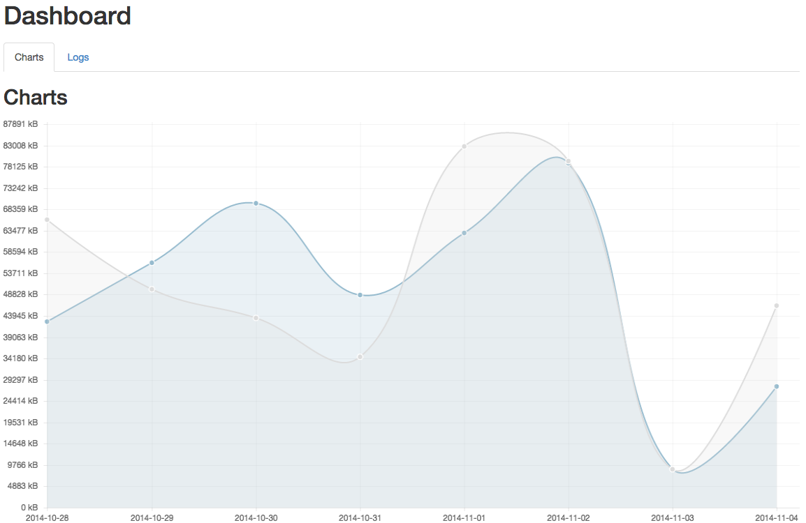
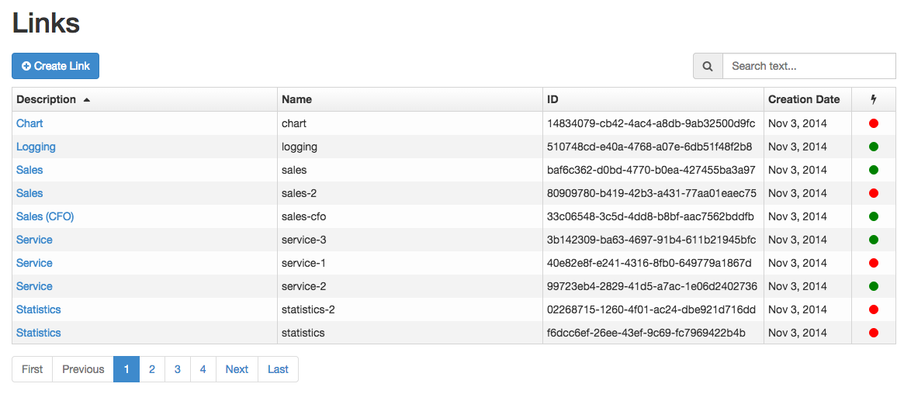
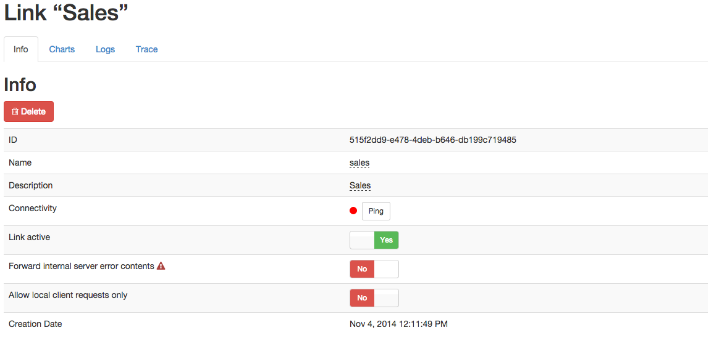

# RelayServer Management Web

Das RelayServer Management Web ist die grafische Benutzeroberfläche zur Konfiguration und Verwaltung des RelayServers durch Administratoren. Es zeigt den aktuellen Systemstatus und die historische Auslastung hinsichtlich Datenvolumen und Anzahl verbundener On-Premises Applikationen.

Für die Analyse von Betriebsproblemen steht außerdem ein umfangreiches Logging und Tracing auf Paketebene zur Verfügung, wenn dieses Feature während der Installation ausgewählt worden ist.

Das RelayServer Management Web ist auch Sicherheitsgründen standardmäßig nur lokal aufrufbar und nicht für den öffentlichen Zugriff freigeschaltet. Der erste Start erfolgt durch Aufruf der URL http://localhost:20000/managementweb/ mit einem aktuellen Browser.

## Ersteinrichtung des RelayServer Management Web

Beim ersten Aufruf des RelayServer Management Web wird automatisch die Erstkonfigurationsmaske angezeigt. Hier kann der initiale Administrator-Benutzter und das zugehörige Passwort angelegt werden.

Nach der Anlage dieses Administrations-Benutzers wird der Anwender automatisch auf die Anmeldemaske weitergeleitet.

## Anmeldung am RelayServer Management Web

Wenn der Anwender noch nicht beim RelayServer Management Web angemeldet ist, erscheint beim Aufruf des Management Webs die Anmeldemaske.

Bei der Anmeldung kann der Anwender eine dauerhaft gültige Session anfordern. Ohne aktivierte Checkbox wird die aktuelle Session beendet, sobald der Anwender den Browser schließt.

## Menüstruktur des RelayServer Management Webs

Die Navigationsleiste des RelayServer Management Webs unterteilt sich in die Bereiche

- Dashboard
- Links
- Users
- Logout

## Menüpunkt Dashboard

Nach der erfolgreichen Anmeldung sieht der Anwender das Dashboard des RelayServer Management Webs. Hier erhält man einen Überblick zum Gesamtsystem.

Der Reiter „Chart" zeigt grafisch den ein- und ausgehenden Datenverkehr der letzten 7 Tage. Jeder Tag ist dabei auf einen Datenpunkt aggregiert.

Der Reiter "Logs" zeigt die letzten 10 empfangenen Client Requests und erlaubt es, zu den einzelnen Requests detailliertere Informationen abzurufen.

## Menüpunkt Links (Provisioning)

Ein Link bezeichnet die freigeschaltete oder gesperrte Verbindung zwischen dem RelayServer und einem On-Premises Connection.

Der Menüpunkt "Links" erlaubt die Verwaltung und Neuanlage von Links im RelayServer.

### Link Übersicht

In der Tabelle werden die folgenden Informationen bereitgestellt:

| Name | Description |
| --- | --- |
| Description | Ein frei wählbarer Name für den Link zu besseren Unterscheidung und Administation |
| Name | URL-fähiger Kurzname des Links (daher keine Sonderzeichen und keine Leerzeichen zulässig) |
| ID | Vom RelayServer für diesen Link automatisch generierte GUID |
| Creation Date | Anlagedatum des Links |
| Connection state | Grün: On-Premises Connector ist verbundenRot: On-Premises Connector ist nicht verbunden |

Über die Suchbox ist eine schnelle Suche nach einem Link möglich. Die Suche inkludiert die Felder Description, Name und ID.

### Neuanlage eines Links

Über die Schaltfläche „Create Link" kann ein neuer Link im RelayServer angelegt werden.

Dazu muss im sich öffnenden Dialog eine Beschreibung und ein Kurzname eingegeben werden. Der Name muss dabei eindeutig sein. Es erscheint eine Fehlermeldung, wenn der eingegebene Name bereits für einen anderen Link verwendet wird.

Nach erfolgreicher Anlage eines neuen Links wird automatisch ein Passwort für den Verbindungsaufbau durch den On-Premises Connector generiert und angezeigt. Dieses Passwort muss unbedingt kopiert und in die Konfigurationsdatei des On-Premises Connectors gespeichert werden. Das Passwort kann nicht noch einmal abgefragt oder verändert werden.

### Details zu einem Link

Wenn die Description eines Links in der Tabelle angeklickt wird, so kommt man auf die Detailseite. Diese unterteilt sich in mehrere Bereiche, die nachfolgend näher beschrieben werden.

#### Info

Der erste Bereich der Detailinformationen zu einem Link ist der Info-Übersicht.

Über den Button „Delete" kann der ausgewählte Link gelöscht werden. Es erscheint eine entsprechende Sicherheitsabfrage, bevor der Link endgültig gelöscht wird. Dabei werden auch alle statistischen Informationen zum Link aus der Datenbank entfernt.

**Achtung** : das Löschen eines Links kann nicht rückgängig gemacht werden.

Folgende Informationen und Konfigurationsmöglichkeiten bietet die Info-Übersicht:

| Name | Description |
| --- | --- |
| ID | Vom RelayServer für diesen Link automatisch generierte GUID |
| Name | URL-fähiger Kurzname des Links (daher keine Sonderzeichen und keine Leerzeichen zulässig) |
| Description | Ein frei wählbarer Name für den Link zu besseren Unterscheidung und Administation |
| Connectivity | Grün: On-Premises Connector ist verbundenRot: On-Premises Connector ist nicht verbunden; über den Button "Ping" kann ein Ping vom RelayServer an den On-Premises Connector geschickt werden |
| Link active | Gibt an, ob der Link aktiviert oder deaktiviert ist. Bei einem deaktivierten Link wird der RelayServer keinen Daten an den Link und damit an den On-Premises Connector weiterleiten. |
| Forward internal server error contents | Standardmäßig löscht der RelayServer den Content Body von Nachrichten der On-Premises Applikation, wenn der Status-Code 500 gesendet wird. Dadurch wird verhindert, dass kritische interne Informationen nach außen gelangen. Sollte beim Debugging diese Information benötigt werden, so kann die Weiterleitung über diesen Schalter aktiviert werden. Es wird nicht empfohlen, diese Option im produktiven Betrieb zu aktivieren. |
| Allow local client requests only | Diese Option ist standardmäßig ausgeschaltet. Wird sie aktiviert, so werden diesem Link nur Anfragen weitergeleitet, die von Localhost kommen. Dies kann sinnvoll sein, wenn vor dem RelayServer eine Web API läuft, welche spezielle Funktionen (z.B. Authentifizierung und Autorisierung) für die Clients zur Verfügung stellt. |
| Creation Date | Anlagedatum des Links |

#### Charts

In der Chartansicht wird grafisch der ein- und ausgehende Traffic für den ausgewählten Link dargestellt. Über Datums-Selektionsfelder und das Dropdown kann der darzustellende Zeitraum spezifiziert werden.

#### Logs

Der Bereich "Logs" zeigt für den ausgewählten Link die letzten 10 empfangenen Client Requests und erlaubt es, zu den einzelnen Requests detailliertere Informationen abzurufen.

#### Trace

Für ein tiefergehendes Debugging von Verbindungen zwischen Client und On-Premises Applikation über den RelayServer kann ein Trace durchgeführt werden. Wenn das Tracing aktiviert ist, werden alle HTTPS Requests und Responses vollständig protokolliert. Im Nachgang können zu jedem einzelnen Request Header- und Content-Informationen angeschaut werden.

Achtung: die Geschwindigkeit einer Verbindung zwischen dem RelayServer und dem entsprechenden Link wird durch einen aktiven Trace-Vorgang negativ beeinflusst. 

Ein Trace-Vorgang wird durch den Button "Start tracing" aktiviert. Er läuft für die eingestellte Minutenzahl und beendet sich danach automatisch. Während ein Trace-Vorgang läuft, kann er jederzeit vorzeitig beendet werden.

Die Ergebnisse eines Trace-Vorgangs finden sich in der Logs-Tabelle. Über den Button "Show results" sind Details zum ausgewählten Trace-Vorgang abrufbar.

##### Trace result

Wenn ein Trace-Vorgang abgeschlossen worden ist und über die Logansicht die Details zu diesem Vorgang aufgerufen werden, dann erscheint folgende Darstellung:

Die erste Tabelle liefert einen Überblick zum ausgewählten Trace-Vorgang:

| Name | Description |
| --- | --- |
| Id | Interne GUID des Trace-Vorgangs |
| Start |  Startzeitpunkt des Trace-Vorgangs |
| End | Endzeitpunkt des Trace-Vorgangs |
| Runtime | Länge des Trace-Vorgangs im Format MM:SS |

Darunter findet sich in einer Tabelle die Darstellung jedes einzelnen Requests aus dem Trace-Vorgang. Die Tabelle enthält die folgenden Informationen:

| Name | Description |
| --- | --- |
| Date |  Zeitpunkt der Client-Anfrage |
| Client header | Header der Client-Anfrage |
| On-Premises Target header | Header der Antwort der On-Premises Applikation |
| Content view | Buttons zur Anzeige oder zum Download der Client-Anfrage und der Antwort der On-Premises Applikation |

Die Buttons zur Anzeige der der Client-Anfrage oder der Antwort der On-Premises Applikation sind nur dann sichtbar, wenn das Format des Elements direkt darstellbar ist (Content-type: text/\*). Sollte es sich um nicht im Browser darstellbaren Content handeln, so besteht die Möglichkeit, das entsprechende Element herunterzuladen.

## Menüpunkt Users

Das RelayServer Management Web erlaubt die Anlage mehrerer verschiedener Administrations-Benutzer. Da es in der aktuellen Version kein umfangreiches Rollenmanagement im RelayServer gibt, hat jeder angelegte User volle Administrationsrechte im Management Web.

Über die Buttons „Edit Password" kann das Passwort des entsprechenden Users neu vergeben werden. Der Button „Delete" löscht den ausgewählten User.
