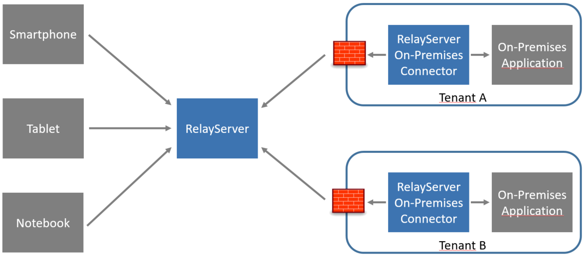
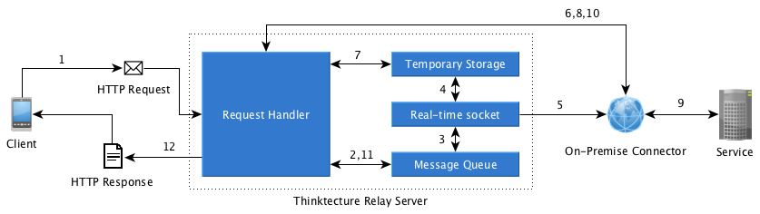

# Components of the RelayServer

## Overview



## RelayServer from the point of view of the client

1. Client communicates with the RelayServer via API calls through Web Requests. These are the application-specific APIs of the target-on-premises application.
1. Client finds the RelayServer through a fixed URL and a DNS query (e.g. https://relay.company.example).
1. Client establishes a connection to the RelayServer if necessary and closes the connection after receiving the answer.
1. There is no need for a permanent connection between client and RelayServer (Request / Response Pattern).
1. No special protocols are used; excluding HTTPS.
1. No special libraries are required for the client, all imaginable client platforms are supported.

## RelayServer from the perspective of the On-Premises application

1. On startup, the On-Premises Connector connects to the configured RelayServer (for example, [https://relay.company.example](https://relay.company.example)).
1. The connection required for this is an exclusively outgoing connection, so that usually no changes to firewalls, routers or NAT systems are necessary.
1. During connection setup, the On-Premises Connector must authenticate to RelayServer.
1. After successful authentication, the On-Premises Connector and thus the On-Premises application are also connected - RelayServer and On-Premises Connector have built up a so-called *Link*. Details on links can be found in the following section.
1. The On-Premises Connector keeps the established connection permanently open over various approaches and waits for possible requests from clients, which relays it to the RelayServer.
1. Inbound requests from clients are accepted by the On-Premises Connector and forwarded to the underlying On-Premises application as a Web Request. From the perspective of the On-Premises application, there is no difference to a "normal" client request.
1. The On-Premises application therefore returns the response to the client request to the On-Premises Connector, which in turn relays the response to the client via the RelayServer.

## Link

A Link is the configured connection between the RelayServer and an On-Premises application (via an On-Premises Connector). A Link is configured in the RelayServer and allows the connection set-up with the authentication key generated by the On-Premises Connector. An existing link can be activated in the mode *activated* or *deactivated*. Only in activated mode, client requests are forwarded to the On-Premises application.

The ability to create links and then enable or disable them as desired results in a reliable and fast mechanism to enable or prevent data exchange with individual On-Premises installations. The technical connection setup is separated from the authorization for communication.

## Data retrieval with and without RelayServer

Example: There is an on-premise application that provides article data for clients on the local network via the Web API. For secure data access, all clients are authenticated and send a corresponding token to the Web API for each request. Accesses without a valid token are rejected by the On-Premises application.
Access to mobile devices has not been planned so far so that the API was only available from the local network at this URL:

```
/articles/getAllArticles
```

The clients should now be able to access these data via a RelayServer, which is accessible at *https://relay.company.example*. How does the use of RelayServer affect this sample setup?

### URL-Schema without RelayServer

The clients use the Web API of the On-Premises application in the local network by GET requests against the URL

```
http://localhost/articles/getAllArticles
```

If the client is not on the same network as the Web API of the On-Premises application, the query fails.

### URL-Schema with RelayServer

Because the RelayServer functions like a transparent reverse proxy, only minimal changes are required to the sample setup. The base URL of the Web API *http://localhost* should normally be stored as a constant in the client and can be easily modified.

We need for the new setup

1. The URL of the RelayServer (*https: //relay.company.example*) including the RelayServer endpoint `relay` and
1. The name of the link under which the corresponding On-Premises Connector connects to the RelayServer, thus making the On-Premises application visible to external clients as well
1. The name for the On-Premises application configured in the On-Premise Connector

In our example, the name of the link is e.g. *mandant1* (Details on setting up a link can be found in the RelayServer Management Web documentation) and the name of the On-Premises application *MyArticleBackend*.

The new URL for the clients GET requests is now:

```
https://relay.company.example/relay/mandant1/MyArticleBackend/articles/getAllArticles
```

Therefore, the necessary change in the overall architecture is limited to the adaptation of a constant in the client. No changes are necessary to the Web API of the On-Premises application. Also, the client's code did not have to be extended by special libraries for communication.

# Technical details

## Connection setup from On-Premises Connector to RelayServer

When the On-Premises Connector is started, a connection to the RelayServer stored in the configuration file is established. Because this is an outgoing HTTPS connection or Secure Websocket connection, there are in most cases no special or critical rules for the On-Premises Connector in firewalls.

If the connection to the RelayServer is successful, the On-Premises Connector must first authenticate itself with a key. This key is communicated out-of-band, eg via secure EMail. After successful authentication, a real-time connection is established between RelayServer and On-Premises Connector. If the On-Premises Connector, as configured in the database, is enabled to communicate with clients, the RelayServer records the status *connected* for the corresponding On-Premises Connector in its database. Messages from clients for the associated On-Premises application are now forwarded.

For the real-time connection, SignalR is used as a connection technology. It also ensures that the established connection between RelayServer and On-Premises Connector remains permanently open. In the event of an interruption of the connection, the functionality of SignalR will also automatically periodically attempt a new connection until a stable connection is established again.

## Request Lifecycle


1. The client sends an API request via HTTPS to the RelayServer, which is received there by the request handler
1. The request handler generates a message, which is stored in a message queue that matches the message and thus the client. At the same time, a thread is generated which is part of the on-premise application's response to the message.
1. A dedicated real-time socket is created for the message that receives the message from the message queue.
1. If the message is very large or contains larger attachments, this part of the message is stored in a temporary memory for reasons of scalability.
1. The Real-Time socket sends the message over the existing Websocket connection to the On-Premises Connector. The message contains the complete http request of the client.
1. If it is a message that is very large or contains attachments, the RelayServer sends the message to the On-Premises Connector with the additional instruction to download the body of the message or attachments from the RelayServer through a separate request. The On-Premises Connector then contacts the request handler of the RelayServer to download the attachment.
1. The request handler loads the desired attachment from temporary storage.
1. The data from the temporary memory is received as a GET operation from the On-Premises Connector. After the successful download, the On-Premises Connector restores both components to the original message.
1. The On-Premises Connector sends the received (and possibly merged) message as an http request to the actual On-Premises application.
1. After the On-Premises application has answered the message, the On-Premises Connector sends the result to the request handler in the RelayServer.
1. The request handler of the RelayServer places the response in its message queue.
1. Since there is a suitable thread waiting for the response through step 2, this thread can receive the response and pass it as a ready-made response to the request handler. The request handler sends the response as a last step to the waiting client and thus successfully completes the waiting client request.
