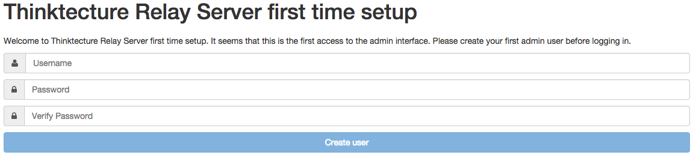
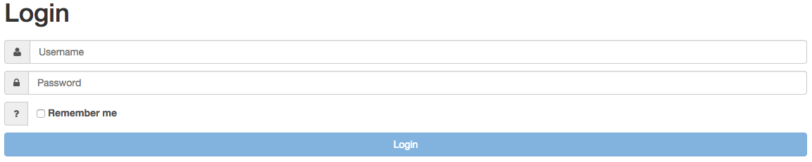
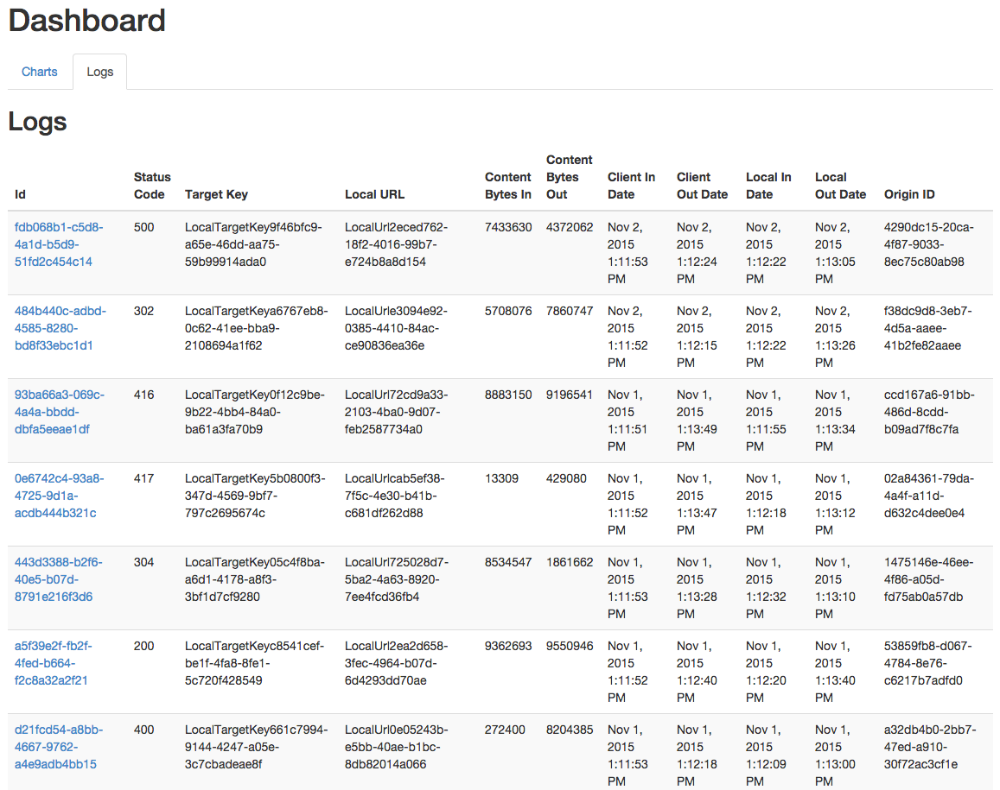
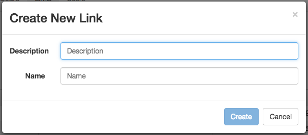
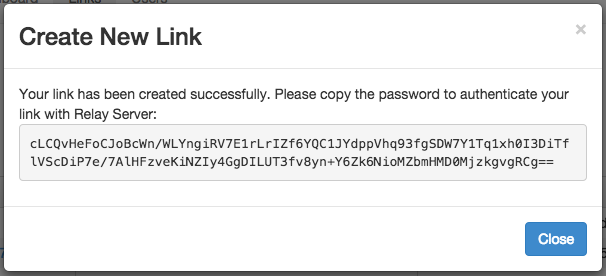
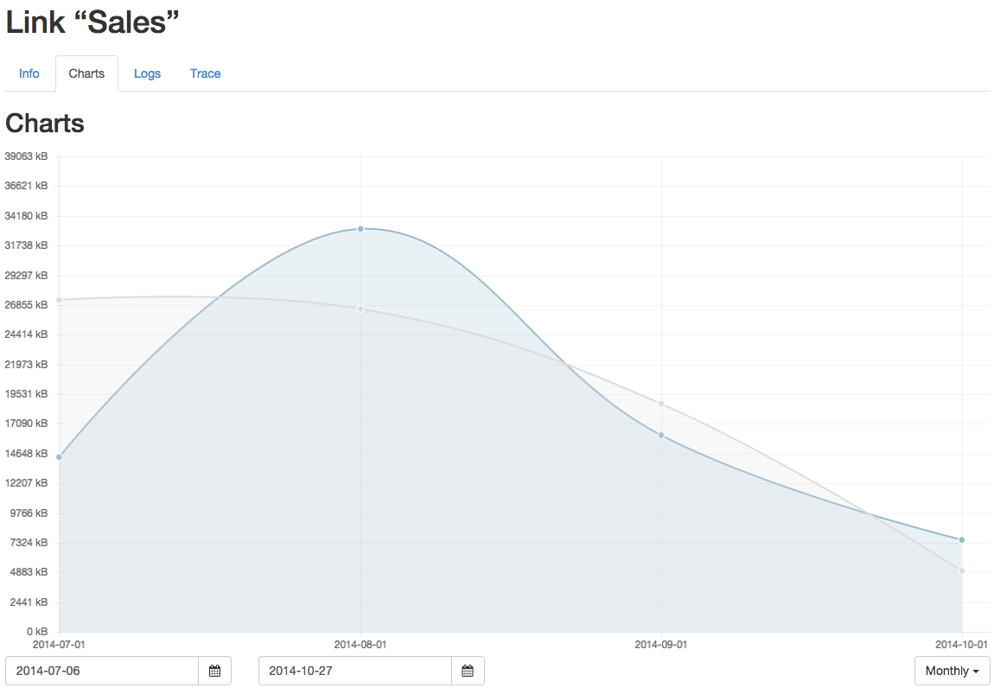
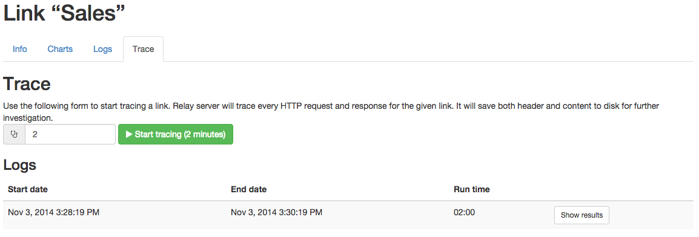
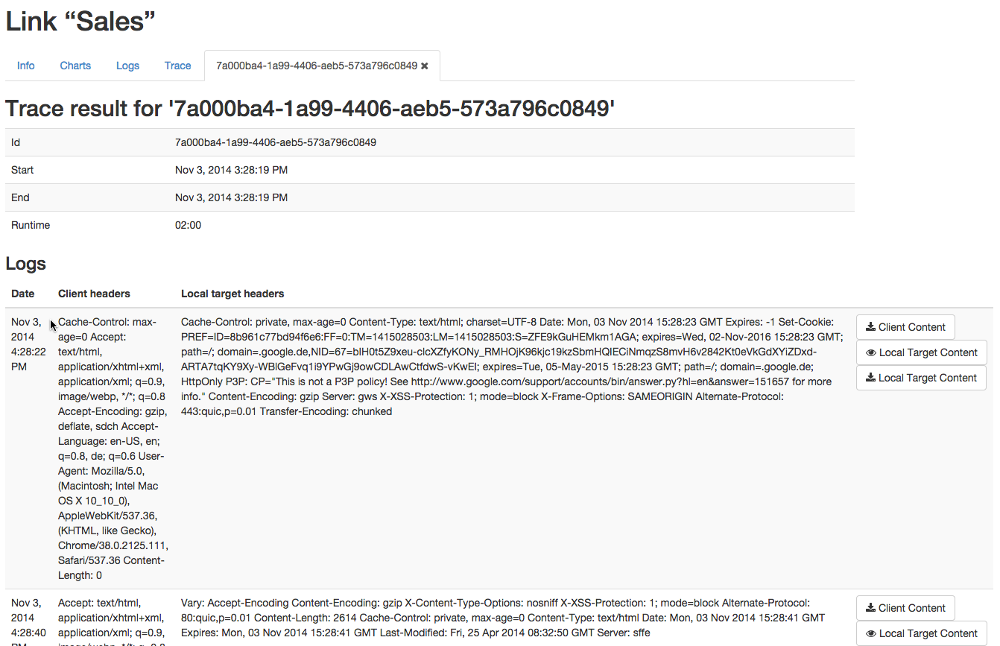
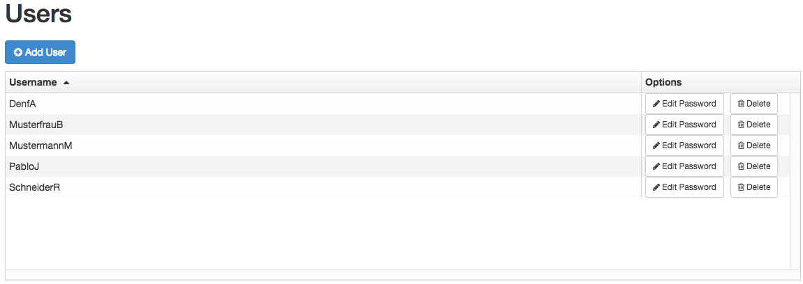

# RelayServer Management Web

The RelayServer Management Web is the graphical user interface for configuring and managing the RelayServer by administrators. It shows the current system status and the historical utilization of data traffic and the number of connected on-premise applications.

Analysis of operating problems is also accompanied by extensive logging and tracing on the packet level, if this feature has been selected during installation.

For security reasons, the RelayServer Management Web is also only locally accessible and can not be activated for public access. The first start is by calling the URL http://localhost:20000/managementweb/. The web management should preferably be used with Google Chrome. The function with other browsers is not necessarily guaranteed.

## Initial setup of the RelayServer Management Web

When the RelayServer Management Web is accessed for the first time, the initial configuration screen is automatically displayed. The initial administrator user and the corresponding password can be created here.

After the creation of this administration user, the user is automatically redirected to the log-on screen.

## Login to RelayServer Management Web

If the user has not yet logged on to the RelayServer Management Web, the log-on screen will appear.

When logging in, the user can request a permanently valid session. Without active checkbox, the current session is terminated as soon as the user closes the browser.

## Menu structure of the RelayServer Management Web

The navigation bar of the RelayServer Management Web is divided into the areas

- Dashboard
- Links
- Users
- Logout

## Dashboard

After successful login, the user sees the Dashboard of the RelayServer Management Web. Here you get an overview of the whole system.

The "Chart" tab shows the incoming and outgoing data traffic of the last 7 days, each day being aggregated to one data point.

The "Logs" tab shows the last 10 received client requests and allows you to retrieve more detailed information on the individual requests.

## Links (Provisioning)

A link is the unlocked or locked connection between the RelayServer and an On-Premises Connection.

The menu item "Links" allows the administration and creation of links in the RelayServer.

### Link Overview

The following information is provided in the table:

| Name | Description |
| --- | --- |
| Description | A freely selectable name for the link to better distinction and administration |
| Name | URL-enabled short name of the link (therefore no special characters and no spaces allowed) |
| ID | GUID generated automatically by the RelayServer for this link |
| Creation Date | Attachment date of the link |
| Connection state | Green: On-Premises Connector is connected Red: On-Premises Connector is not connected |

The search box allows a quick search for a link. The search includes the fields Description, Name and ID.

### Create a new link

A new link can be created in the RelayServer via the "CreateLink" button.

To do this, a description and a short name must be entered in the dialog. The name must be unique. An error message appears if the entered name is already in use for another link.

After successful creation of a new link, a password for the connection setup is automatically generated and displayed by the On-Premises Connector. This password must be copied and saved to the configuration file of the On-Premises Connector. The password can not be queried or changed again.

### Details of a link

If the description of a link in the table is clicked, you are directed to the details page. This is divided into several areas, which are described in more detail below.

#### info

The first section of the detail information for a link is the info overview.

The "Delete" button can be used to delete the selected link, and a corresponding security query will be displayed before the link is finally deleted. On deletion, all statistical information on the link will also be removed from the database.

**Attention**: deleting a link can not be undone.

The following information and configuration options are available:

| Name | Description |
| --- | --- |
| ID | GUID generated automatically by the RelayServer for this link |
| Name | URL-enabled short name of the link (therefore no special characters and no spaces allowed)|
| Description | A freely selectable name for the link to better distinction and administration|
| Connectivity | Green: On-Premises Connector is connected Red: On-Premises Connector is not connected; Click the "Ping" button to send a ping from RelayServer to the On-Premises Connector |
| Link active | Indicates whether the link is enabled or disabled. If a link is disabled, the RelayServer will not forward data to the link and therefore to the On-Premises Connector. |
| Forward internal server error contents | By default, the RelayServer deletes the content body of messages from the On-Premises application when a server error status code 500 is sent. This prevents critical internal information from getting to the outside. If this information is required during debugging, the relay of error messages can be activated via this switch. It is not recommended to enable this option in productive mode. |
| Allow local client requests only | This option is off by default. If it is activated, this link will only forward requests from Localhost. This can be useful if a Web API runs before the RelayServer, which provides specific functions (for example, authentication and authorization) for the clients. |
| Creation Date | Attachment date of the link |

#### Charts

The chart shows the incoming and outgoing traffic for the selected link. The date range to be displayed can be specified via date selection fields and the dropdown.

#### Logs

The "Logs" area shows the last 10 received client requests for the selected link and allows you to retrieve more detailed information on the individual requests.

#### Trace

A trace can be performed for a further debugging of connections between client and On-Premises application via RelayServer. If the tracing is activated, all HTTPS requests and responses are logged with all details. In the following, header and content information can be viewed for each individual request.

Note: the speed of a connection between the RelayServer and the corresponding link is adversely affected by an active trace operation.

A trace operation is activated by the "Start tracing" button. It runs for the set number of minutes and then ends automatically. While a trace is running, it can be terminated at any time.

The results of a trace operation can be found in the logs table. The "Show results" button provides details on the selected trace process.

##### Trace result

If a trace operation has been completed and the details for this process are called up via the log view, the following display appears:

The first table provides an overview of the selected trace operation:

| Name | Description |
| --- | --- |
| Id | Internal GUID of the trace operation |
| Start |  Startzeitpunkt des Trace-Vorgangs |
| End | Start time of the trace operation |
| Runtime | Length of time for trace operation in format MM:SS |

Below is a table showing each request from the trace process. The table contains the following information:

| Name | Description |
| --- | --- |
| Date |  Time of the client request |
| Client header | Header of the client request |
| On-Premises Target header | Header of the response of the On-Premises application |
| Content view | Buttons to display or download the client request and the response of the On-Premises application |

The buttons for displaying the client request or the response of the On-Premises application are only visible if the format of the element can be displayed directly (Content-type: text/\*). If the content cannot be displayed in the browser (i.e. binary files), it is possible to download the corresponding element.

## Users

The RelayServer Management Web allows the creation of several different administration users. Since there is no extensive role management in RelayServer in the current version, each created user has full administration rights in the web management.

The "Edit Password" button can be used to assign the password of the corresponding user. The "Delete" button deletes the selected user.
