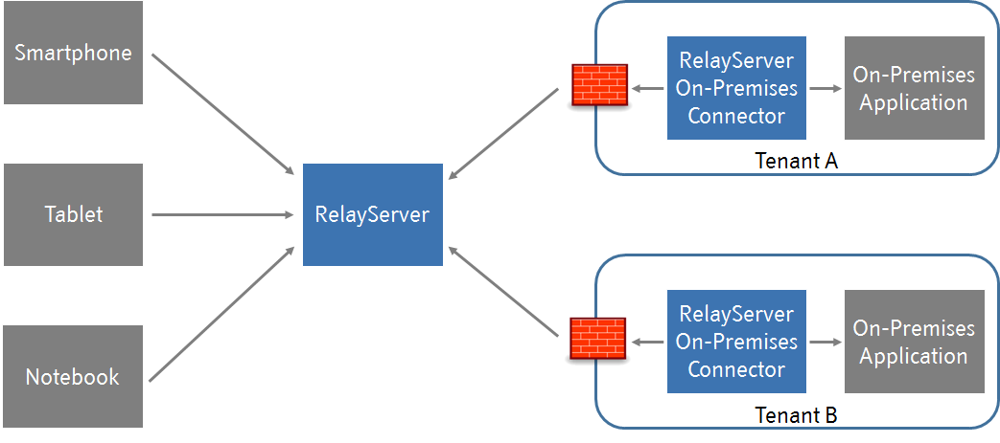

# Thinktecture RelayServer

Thinktecture RelayServer enables secure communication from clients - including mobile devices, web, and native
applications - to their on-premises backend applications.

The client can be any kind of application which uses REST-style HTTPS requests to exchange data with on-premises
applications. You can use RelayServer to provide backend communication for your HTML5 apps and for native apps on
Windows, iOS, Android, Blackberry, Smart TVs, and many more. There is no special library or code change needed as
RelayServer acts as a transparent HTTPS reverse proxy.

The on-premises applications can be located behind routers and firewalls and only need a single outgoing port to be able
to handle clients' requests. They will use this port to establish a persistent connection with your internet-accessible
RelayServer instance. This connection will be managed by an embeddable component (or windows service) called RelayServer
Connector. If your on-premises application uses some kind of Web-based API to communicate with the client you are ready
to go.

All data communication will be secured via https with complete control and auditing of allowed participants and
permitted data.

## Library concept

Thinktecture RelayServer v3 is more of a collection of libraries than a few ready-to run executables. We looked at
how RelayServer v2 was used previously and learned that in most cases a lot of customization and extension was
performed. This is now much easier to achieve in RelayServer v3, by providing all components and modules in an
exchangeable way for you to build your own product and services with RelayServer as a library.

## Contents of the documentation

- See the [glossary](./docs/glossary.md) for a further description of terms used in the context of RelayServer.
- See [concepts](./docs/concepts.md) for an explanation of concepts used in RelayServer.
- See [getting started with development](./docs/development-getting-started.md) for an overview of how to setup a
  development environment for RelayServer.
- See [deployment options](./docs/deployment.md) for an overview of deployment options.
- See [modules](./docs/modules.md) for an overview of the new modular design of RelayServer 3 and modules supported out
  of the box.
- See [migration](./docs/migration.md) for some ideas how to migrate from RelayServer 2 to version 3.
- See [configuration](./docs/configuration.md) for some guidance on how to configure the RelayServer 3 components.
- See [release notes](./docs/release-notes.md) for the latest release notes on RelayServer 3.

## Features

- Open Source under BSD-3-Clause license
- Full data sovereignty without the need to tunnel data over public relays operated by third parties
- No special client-side library needed - it's technically only an distributed HTTPS reverse proxy
- Supports multiple tenants with provisioning - you would usually connect thousands of on-premises installation via one
  RelayServer instance
- Firewall, NAT & Proxy-friendly
- No static ip address needed for on-premise applications
- No hardware for on-premises side needed
- No open incoming firewall ports
- No VPN setup

## Sponsors

We would like to thank our sponsors that helped to make RelayServer possible.

### Switzerland

